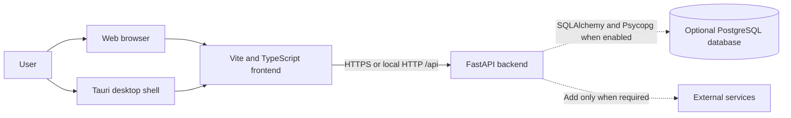
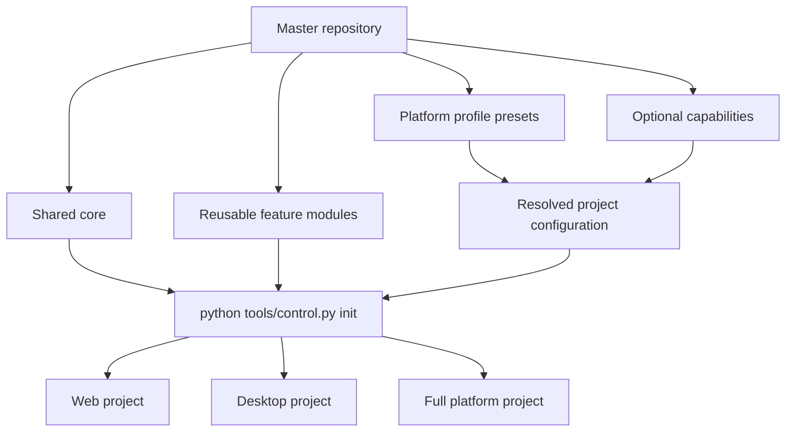
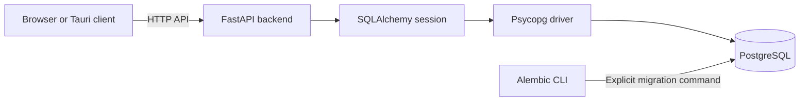
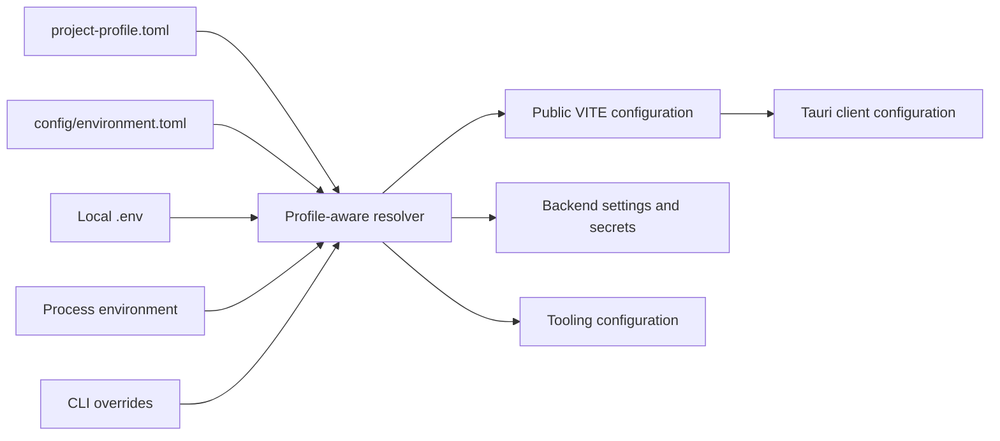
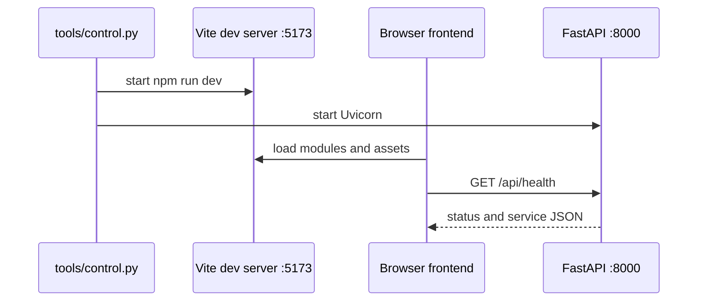
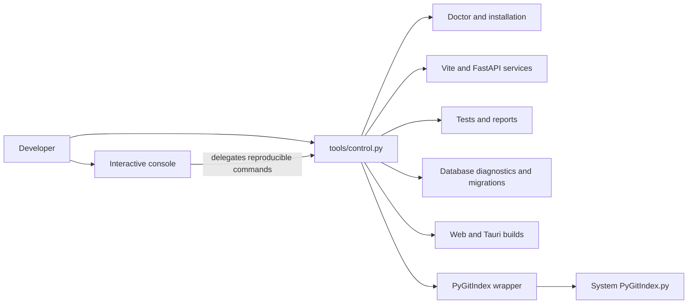
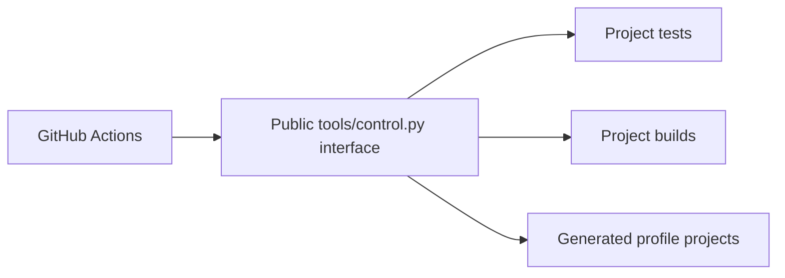
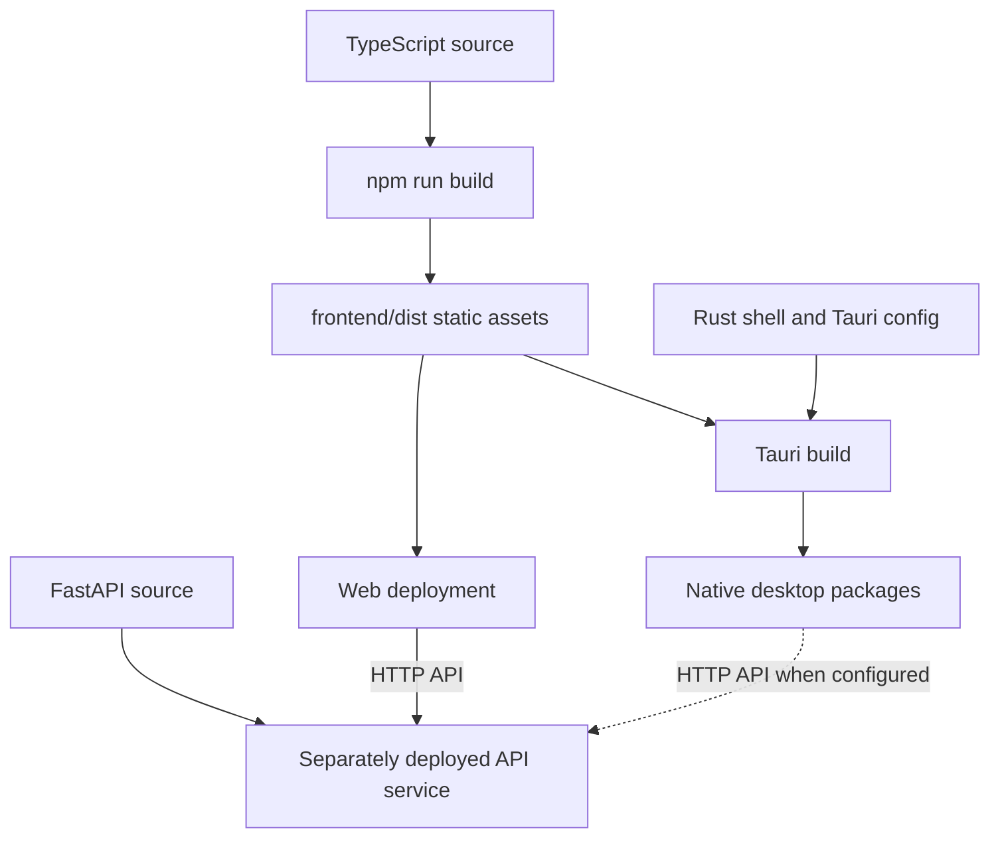

<!-- AUTO-GENERATED:backlink START -->
[← Back](def.md)
<!-- AUTO-GENERATED:backlink END -->
# Framework architecture

| Field | Value |
| --- | --- |
| Status | Active |
| Owner | Project team |
| Last review | 2026-08-06 |
| Audience | Developers and architects |
| Related ATP | N/A — template-level architecture |

## Purpose

This document defines the baseline architecture of the project template, the shared feature modules, and the profile-based scaffold model. It explains how Vite, TypeScript, FastAPI, Tauri and optional server capabilities work together, and how project profiles reuse that same base without becoming separate template implementations. Product-specific projects must update this document when they add deployment units, trust boundaries or framework-level dependencies.

## Scope

The architecture covers the web frontend, HTTP backend, desktop shell, shared contracts, optional database infrastructure, provider-neutral container boundary, profile generator, and local development tooling. It does not prescribe a product domain, database schema, authentication provider, cloud vendor, or production credential system.

## System context



The same frontend source supports two hosts. A browser downloads the static build from a web server. Tauri loads the same static build into a native webview. The frontend reaches FastAPI through an explicit HTTP API; it must not depend on backend Python modules or internal file paths.

## Runtime containers

| Container | Framework | Responsibility | Must not contain |
| --- | --- | --- | --- |
| Frontend | Vite + TypeScript | Presentation, browser interaction, client-side state and typed API clients | Server secrets, direct database access or Python imports |
| Backend | FastAPI + Uvicorn | HTTP contracts, validation, application orchestration and server-side integrations | Browser DOM logic or desktop UI concerns |
| Database capability | SQLAlchemy 2 + Alembic | Server-side persistence configuration, sessions and schema migrations | Product models, automatic startup migrations or client-side database access |
| PostgreSQL capability | Psycopg 3 | Optional PostgreSQL driver and connectivity checks | Credentials committed to source control |
| Desktop shell | Tauri 2 + Rust | Native window, packaging and explicitly approved native capabilities | Product business logic that also belongs to the web version |
| Shared | JSON and static assets | Framework-neutral contracts and examples consumed across boundaries | Executable framework-specific behavior |
| Tooling | Python | Local lifecycle commands spanning more than one container | Product runtime behavior |

## Repository mapping

```text
frontend/src/
├── api/                 Typed HTTP boundary
├── styles/              Global template styles
└── main.ts              Browser composition root

backend/app/
├── api/                 FastAPI routers and HTTP models
├── db/                  Optional SQLAlchemy configuration and sessions
└── main.py              Backend composition root and middleware

backend/alembic/          Optional Alembic migration environment

shared/
├── assets/              Cross-runtime static assets
├── examples/            Contract examples
└── schema/              JSON Schema or other neutral interface definitions

src-tauri/
├── capabilities/        Tauri permission allowlists
├── icons/               Generated platform icons
└── src/main.rs          Native composition root

profiles/
├── features.toml        Core paths, feature ownership and dependencies
└── *.toml               Named profile presets

project-profile.toml     Active profile manifest for the current project root

config/
└── environment.toml     Shared environment variable contract

deployment/
├── compose.yaml         Local production simulation
└── docker/              Backend and optional frontend images

VERSION                  Application version source of truth
```

Feature folders should be introduced only when the first real feature exists. Keep a feature's UI, state and tests close together, while reusable infrastructure remains at the framework boundary.

## Profile presets and generator



Profiles are configuration presets over reusable features, not independent template implementations. Platform profiles select the runtime shape, while optional capabilities extend a compatible profile without creating another profile. For example, `web-cloud` selects `frontend + backend + cloud`; `--with postgres` adds `postgres`, resolves its `database` dependency, and reuses the same backend implementation.

The master repository keeps the complete baseline. The generator validates the selected profile and capabilities, resolves dependencies, selects core paths plus feature-owned paths, writes `project-profile.toml` for the derived project, and rewrites the frontend profile module when the frontend feature is enabled. This allows the shared tooling to stay in one codebase while generated projects omit disabled runtime layers and dependencies.

## Optional database interaction



Only the backend and explicit migration commands may access PostgreSQL. Engine creation is lazy and never opens a connection during module import. Application startup does not create, drop or migrate schemas; operators run Alembic explicitly through `python tools/control.py db`.

## Configuration architecture



Project structure and runtime environment are independent axes. The profile answers what the project contains. Environment values answer how that project runs in development, test, or production. Resolution priority is CLI override, process environment, local `.env`, then contract default.

Frontend code receives only explicitly public `VITE_` values. Backend Settings consume server runtime values and secrets. Tooling reads the shared contract directly, while each application runtime keeps a technology-specific adapter instead of depending on a global Python settings module.

## Development interaction



For profiles with both `frontend` and `backend`, `python tools/control.py run` starts Vite and Uvicorn as sibling foreground processes. Reduced profiles start only their enabled services. The Vite server performs hot-module replacement. FastAPI serves the `/api` namespace and allows only configured development or desktop origins through CORS when the backend is enabled.

`python tools/control.py tauri run --foreground` lets Tauri start Vite through `beforeDevCommand`. It does not start FastAPI. When a desktop feature requires the API during development, run the backend separately or use the combined web command before starting Tauri with an adjusted workflow.

## Tooling control flow



`tools/control.py` is the only public command dispatcher. The interactive console does not duplicate build or test logic; it invokes the same CLI commands in subprocesses and adds descriptions, safe defaults, and confirmations. This keeps interactive actions reproducible in local shells and CI.

GitHub Actions follows the same boundary:



CI orchestrates the same project tooling used by developers locally. Workflow files set up runtimes, caches, temporary services, and job boundaries; they do not reimplement profile, test, migration, or build behavior.

The same CLI also exposes `python tools/control.py init`, which scaffolds a derived project from the declarative profile catalog. Optional capabilities are selected with `--with`, for example `init --profile web-cloud --with postgres`. The active generated project stores its selected optional capabilities and fully resolved features in `project-profile.toml`, and the shared tooling reads that manifest to skip disabled components instead of treating them as missing by default.

The documentation command locates the system `PyGitIndex.py` script and delegates index, README navigation, and backlink generation to it. A narrow post-processing step translates only known non-English empty-state labels inside generated markers. Authored documentation is not automatically rewritten.

## Build and deployment interaction



The backend is a separate deployment unit. `deployment/docker` provides a provider-neutral non-root image, while `frontend/dist` remains independently deployable to static hosting. The template does not embed Python into desktop packages and does not start an API sidecar in production. A derived project must make and document one explicit choice:

1. deploy FastAPI as a remote HTTPS service;
2. package and supervise it as a desktop sidecar; or
3. keep a feature fully local and expose narrowly scoped Tauri commands instead of using FastAPI.

That decision changes packaging, updates, observability and the security model, so it requires an architecture update and an ATP.

## Dependency rules

1. `frontend` may depend on public HTTP contracts and browser-safe shared files.
2. `backend` may depend on shared schemas but never on frontend implementation files.
3. `src-tauri` may expose native capabilities only when the web version cannot provide the required behavior safely.
4. Shared contracts remain serializable and framework-neutral.
5. Route handlers stay thin: product logic belongs in backend service or domain modules introduced by the derived project.
6. Frontend views call the API through modules under `frontend/src/api`; scattered raw URLs are not allowed.
7. Every cross-container contract change includes consumer tests and an ATP update.
8. `postgres` requires `database`, and `database` requires `backend`; invalid capability combinations fail before scaffolding.
9. Frontend and Tauri code never connect directly to PostgreSQL or receive `DATABASE_URL`.
10. `project-profile.toml` never stores runtime environment values or secrets.
11. Client configuration is explicitly public; non-`VITE_` server values never enter the frontend application API.

## Security boundaries

The browser or webview is an untrusted client. FastAPI validates every request regardless of frontend validation. Secrets stay in the backend or an operating-system secret store; no secret may use a `VITE_` variable because Vite exposes those values to client code.

Tauri capabilities follow least privilege. The template grants only `core:default`. Its Content Security Policy restricts assets and connections to the local application and documented local development endpoints. A desktop-cloud product adds only its exact HTTPS API origin to `connect-src`. Derived projects add individual permissions together with threat analysis, architecture documentation and acceptance coverage.

CORS is not authentication. Before exposing the API beyond local development, add an authentication and authorization design, HTTPS, request limits, structured logging and an environment-specific origin allowlist.

Database credentials are process environment values and are never written to generated frontend files, logs or committed configuration. The generator may add only a placeholder to `.env.example`. `DATABASE_URL_TEST` is separate from development or production configuration, and PostgreSQL integration tests skip unless that dedicated variable is supplied.

## Extension path

When starting a product from this template:

1. Define the first user capability and its acceptance criteria.
2. Add domain-neutral request and response contracts.
3. Implement backend behavior behind a router or deliberately choose a local-only Tauri command.
4. Add a typed frontend adapter and keep rendering independent from transport details.
5. Add automated tests at the narrowest useful layer.
6. Create and execute the corresponding ATP.
7. Update this architecture if a new container, data store, external system or trust boundary is introduced.

## Verification

Run all baseline checks from the repository root:

```sh
python tools/control.py doctor
python tools/control.py test --suite all
python tools/control.py build web
python tools/control.py version check
python tools/control.py container validate
python tools/control.py docs index --dry-run
```

A desktop-capable environment additionally runs:

```sh
python tools/control.py tauri doctor
python tools/control.py tauri test --all
python tools/control.py build desktop
```

## Related documents

- [Project README](../../README.md)
- [Project profiles](project-profiles.md)
- [Optional database feature](database-feature.md)
- [Runtime configuration](configuration.md)
- [Deployment architecture](deployment-architecture.md)
- [Documentation standard](../README.md)
- [ATP workflow](../atp/README.md)
- [Tooling guide](../tools/tooling.md)
- [Continuous integration](../tools/ci.md)
- [Release model](../tools/release-model.md)
