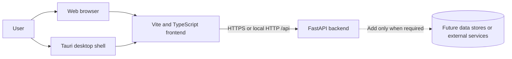
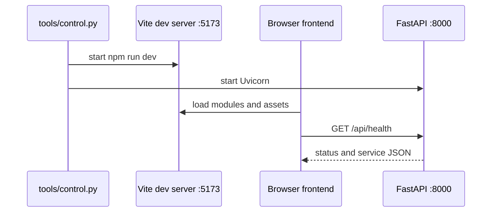
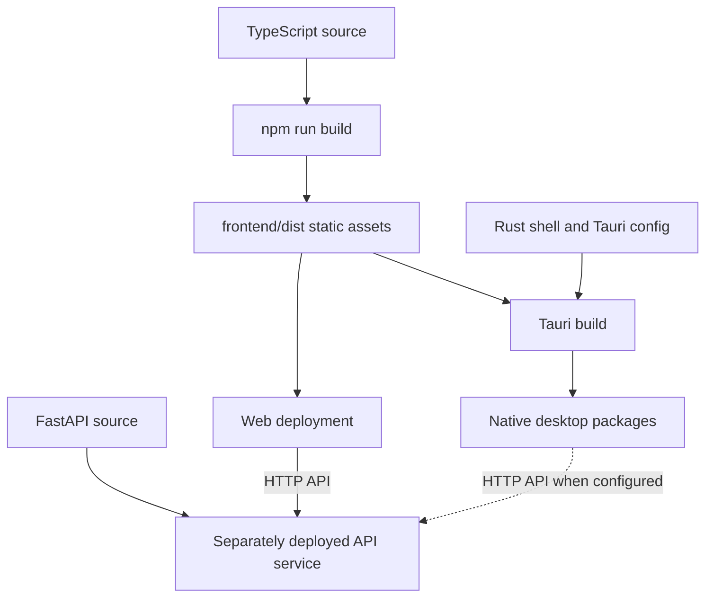

# Framework architecture

| Field | Value |
| --- | --- |
| Status | Active |
| Owner | Project team |
| Last review | 2026-08-05 |
| Audience | Developers and architects |
| Related ATP | N/A — template-level architecture |

## Purpose

This document defines the baseline architecture of the project template and explains how Vite, TypeScript, FastAPI and Tauri work together. Product-specific projects must update this document when they add deployment units, trust boundaries or framework-level dependencies.

## Scope

The architecture covers the web frontend, HTTP backend, desktop shell, shared contracts and local development tooling. It does not prescribe a product domain, database, authentication provider, cloud platform or desktop backend packaging strategy.

## System context



The same frontend source supports two hosts. A browser downloads the static build from a web server. Tauri loads the same static build into a native webview. The frontend reaches FastAPI through an explicit HTTP API; it must not depend on backend Python modules or internal file paths.

## Runtime containers

| Container | Framework | Responsibility | Must not contain |
| --- | --- | --- | --- |
| Frontend | Vite + TypeScript | Presentation, browser interaction, client-side state and typed API clients | Server secrets, direct database access or Python imports |
| Backend | FastAPI + Uvicorn | HTTP contracts, validation, application orchestration and server-side integrations | Browser DOM logic or desktop UI concerns |
| Desktop shell | Tauri 2 + Rust | Native window, packaging and explicitly approved native capabilities | Product business logic that also belongs to the web version |
| Shared | JSON and static assets | Framework-neutral contracts and examples consumed across boundaries | Executable framework-specific behavior |
| Tooling | Python | Local lifecycle commands spanning more than one container | Product runtime behavior |

## Repository mapping

```text
frontend/src/
├── api/                 Typed HTTP boundary
├── styles/              Global template styles
└── main.ts              Browser composition root

backend/app/
├── api/                 FastAPI routers and HTTP models
└── main.py              Backend composition root and middleware

shared/
├── assets/              Cross-runtime static assets
├── examples/            Contract examples
└── schema/              JSON Schema or other neutral interface definitions

src-tauri/
├── capabilities/        Tauri permission allowlists
├── icons/               Generated platform icons
└── src/main.rs          Native composition root
```

Feature folders should be introduced only when the first real feature exists. Keep a feature's UI, state and tests close together, while reusable infrastructure remains at the framework boundary.

## Development interaction



`python3 tools/control.py run` starts Vite and Uvicorn as sibling foreground processes. The Vite server performs hot-module replacement. FastAPI serves the `/api` namespace and allows only configured development or desktop origins through CORS.

`python3 tools/control.py tauri dev` lets Tauri start Vite through `beforeDevCommand`. It does not start FastAPI. When a desktop feature requires the API during development, run the backend separately or use the combined web command before starting Tauri with an adjusted workflow.

## Build and deployment interaction



The backend is a separate deployment unit. The template does not embed Python into desktop packages and does not start an API sidecar in production. A derived project must make and document one explicit choice:

1. deploy FastAPI as a remote HTTPS service;
2. package and supervise it as a desktop sidecar; or
3. keep a feature fully local and expose narrowly scoped Tauri commands instead of using FastAPI.

That decision changes packaging, updates, observability and the security model, so it requires an architecture update and an ATP.

## Dependency rules

1. `frontend` may depend on public HTTP contracts and browser-safe shared files.
2. `backend` may depend on shared schemas but never on frontend implementation files.
3. `src-tauri` may expose native capabilities only when the web version cannot provide the required behavior safely.
4. Shared contracts remain serializable and framework-neutral.
5. Route handlers stay thin: product logic belongs in backend service or domain modules introduced by the derived project.
6. Frontend views call the API through modules under `frontend/src/api`; scattered raw URLs are not allowed.
7. Every cross-container contract change includes consumer tests and an ATP update.

## Security boundaries

The browser or webview is an untrusted client. FastAPI validates every request regardless of frontend validation. Secrets stay in the backend or an operating-system secret store; no secret may use a `VITE_` variable because Vite exposes those values to client code.

Tauri capabilities follow least privilege. The template grants only `core:default`. Derived projects add individual permissions together with threat analysis, architecture documentation and acceptance coverage. Production projects must replace the template's null Content Security Policy with a restrictive policy suitable for their content and API endpoints.

CORS is not authentication. Before exposing the API beyond local development, add an authentication and authorization design, HTTPS, request limits, structured logging and an environment-specific origin allowlist.

## Extension path

When starting a product from this template:

1. Define the first user capability and its acceptance criteria.
2. Add domain-neutral request and response contracts.
3. Implement backend behavior behind a router or deliberately choose a local-only Tauri command.
4. Add a typed frontend adapter and keep rendering independent from transport details.
5. Add automated tests at the narrowest useful layer.
6. Create and execute the corresponding ATP.
7. Update this architecture if a new container, data store, external system or trust boundary is introduced.

## Verification

Run all baseline checks from the repository root:

```sh
python3 tools/control.py doctor
python3 tools/control.py test
python3 tools/control.py build
```

A desktop-capable environment additionally runs:

```sh
python3 tools/control.py tauri info
python3 tools/control.py test --suite desktop
```

## Related documents

- [Project README](../../README.md)
- [Documentation standard](../README.md)
- [ATP workflow](../atp/README.md)
