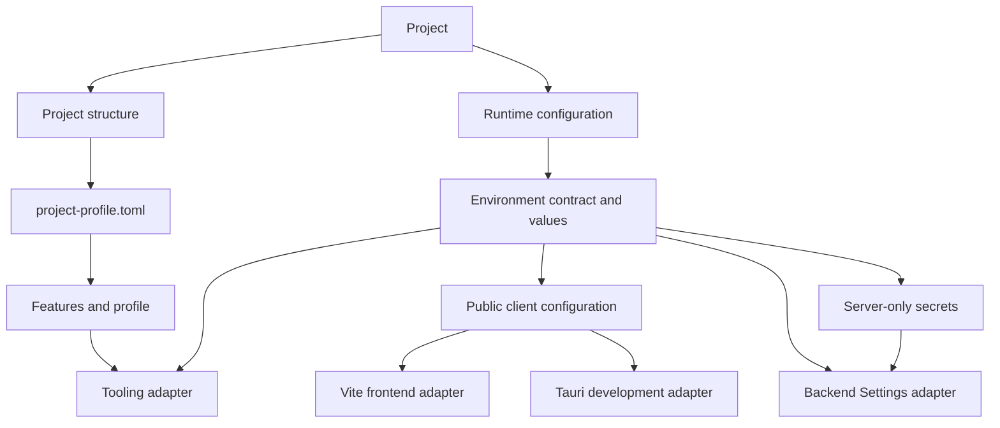

<!-- AUTO-GENERATED:backlink START -->
[← Back](def.md)
<!-- AUTO-GENERATED:backlink END -->
# Runtime configuration

| Field | Value |
| --- | --- |
| Status | Active |
| Owner | Project team |
| Last review | 2026-08-13 |
| Audience | Developers and operators |
| Related ATP | N/A — template-level configuration contract |

## Purpose

This document defines one configuration contract with runtime-specific adapters. Project profiles define what a project contains. Environment configuration defines how that project runs. Product persistence defines where user data lives and is a separate concern. Secrets are server-side runtime configuration and never become client configuration.

## Scope

### Included

- the declarative environment contract in `config/environment.toml`;
- local `.env` loading and source precedence;
- profile-aware `.env.example` generation;
- tooling, Backend Settings, Vite, and Tauri adapters;
- configuration diagnostics and masked display; and
- local CORS origin configuration.

### Excluded

- cloud-provider secret stores and vendor-specific deployment adapters;
- CI configuration;
- managed secret stores;
- authentication and authorization;
- production credential generation; and
- product/user data storage or persistence-provider selection.

## Architecture



`project-profile.toml` contains the profile, optional capabilities, and resolved features. It never contains ports, hosts, environment names, URLs, credentials, or product/user data. Runtime environments are `development`, `test`, and `production`; they do not create additional project profiles. Likewise, `.env` and `config/environment.toml` configure application execution and must not be used as product-data stores.

## Configuration sources

Effective values use this priority, from highest to lowest:

1. explicit CLI override;
2. process environment;
3. local root `.env`;
4. template default from `config/environment.toml`.

An explicit `VITE_API_BASE_URL` follows the same priority. When it is absent and both frontend and backend are enabled, tooling and Vite derive the development URL from the effective backend host and port. A wildcard bind host is converted to `127.0.0.1` for the browser-facing URL.

The tooling loader reads `.env` without mutating `os.environ`. Runtime launchers pass only the relevant resolved values to child processes. System, CI, container, or cloud environment values therefore override local files naturally.

## Environment contract

| Variable | Scope | Secret | Required when | Default or derivation |
| --- | --- | ---: | --- | --- |
| `APP_ENV` | Shared runtime | No | Always | `development` |
| `APP_NAME` | Backend | No | `backend` | `Template Project API` |
| `FRONTEND_HOST` | Tooling and Vite | No | `frontend` | `127.0.0.1` |
| `FRONTEND_PORT` | Tooling and Vite | No | `frontend` | `5173` |
| `VITE_API_BASE_URL` | Public frontend | No | `frontend + backend` | Derived from backend host and port |
| `BACKEND_HOST` | Backend and tooling | No | `backend` | `127.0.0.1` |
| `BACKEND_PORT` | Backend and tooling | No | `backend` | `8000` |
| `BACKEND_CORS_ORIGINS` | Backend | No | `backend` | Derived local browser and Tauri origins |
| `DATABASE_URL` | Backend secret | Yes | `postgres` | None |

`BACKEND_CORS_ORIGINS` is a comma-separated list. When it is not explicit, tooling derives browser origins from the effective frontend host and port and adds the local Tauri origins. Wildcard origins are invalid. The deprecated `CORS_ORIGINS` name remains accepted for existing local environments, but new configuration uses `BACKEND_CORS_ORIGINS`.

## Local configuration files

The root `.env.example` is a generated-safe contract example and contains placeholders only. The project generator renders it from `config/environment.toml` and includes only variables relevant to the resolved feature set.

Local overrides belong in the ignored root `.env`. Installation never creates or overwrites this file. Create it deliberately when defaults are insufficient:

```sh
cp .env.example .env
```

Do not commit `.env`, `.env.local`, or `.env.*.local`. Do not put production secrets in `.env.example`.

## Runtime adapters

### Tooling

`tools/config/` loads and validates the contract. `run`, `stop`, `doctor`, tests, DB commands, builds through Vite, Tauri development, and the generator use this layer or the same declarative contract. Port CLI flags override every other source.

### Backend

`backend/app/config/settings.py` uses `pydantic-settings` for typed environment and root `.env` loading. It validates environment names, ports, hosts, and CORS origins. `DATABASE_URL` uses `SecretStr` and remains optional until database infrastructure requests it.

### Frontend

Vite reads the root `.env`. Non-`VITE_` values configure the development server and derive the API URL inside `vite.config.ts`; they are not exposed to application code. Automatic `VITE_*` exposure is disabled. Only `VITE_API_BASE_URL` is declared in `ImportMetaEnv` and explicitly embedded in backend-enabled frontend bundles.

### Tauri

Tauri development receives only frontend host, port, backend endpoint metadata, and `VITE_API_BASE_URL`. Known secret variables are removed from the Tauri process environment. Desktop clients continue to reach PostgreSQL only through FastAPI.

Production containers use the same priority and variable names. Docker does not introduce a second application configuration contract. Compose interpolation and platform environment injection are process-environment sources; they override a local `.env` through the existing resolver. The frontend image accepts only the public `VITE_API_BASE_URL` build argument, while backend and migration workloads receive server-side values at runtime.

## CLI

Display effective values and their source:

```sh
python tools/control.py config show
```

Secrets are masked. Validate configuration without opening network connections or changing files:

```sh
python tools/control.py config doctor
```

CLI precedence can be inspected directly:

```sh
python tools/control.py config show --backend-port 9000
python tools/control.py run --backend-port 9000
```

Database driver imports and optional read-only connectivity remain the responsibility of `python tools/control.py db doctor`.

## Security

- Only variables deliberately prefixed with `VITE_` may become browser configuration.
- `DATABASE_URL`, password, token, API key, private key, and secret values are masked by shared tooling utilities.
- Frontend and Tauri development environments exclude known secret names.
- Pydantic hides input values in backend validation errors.
- No command generates credentials or automatically changes `.env`.
- FastAPI startup does not migrate or create database schemas.

## Verification

```sh
python tools/control.py config show
python tools/control.py config doctor
python tools/control.py doctor
python tools/control.py test --suite tools
python tools/control.py build web
```

## Related documents

- [Framework architecture](architecture.md)
- [Provider-neutral persistence architecture](persistence-architecture.md)
- [Project profiles](project-profiles.md)
- [Database feature](database-feature.md)
- [Deployment architecture](deployment-architecture.md)
- [Tooling Guide](../tools/tooling.md)
- [Documentation Standard](../README.md)
