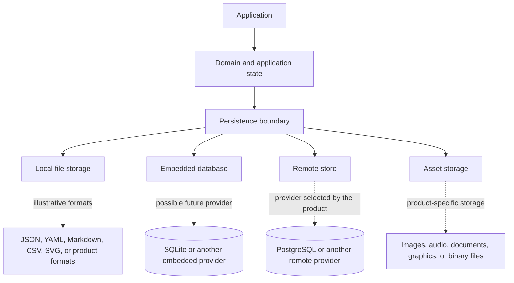
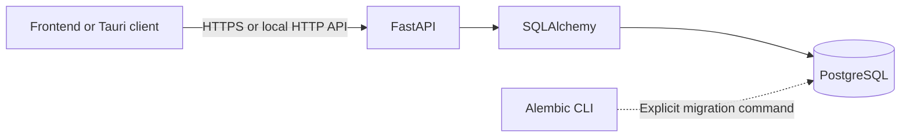

<!-- AUTO-GENERATED:backlink START -->
[← Back](def.md)
<!-- AUTO-GENERATED:backlink END -->
# Provider-neutral persistence architecture

| Field | Value |
| --- | --- |
| Status | Active |
| Owner | Project team |
| Last review | 2026-08-13 |
| Audience | Product developers and architects |
| Related ATP | N/A — template-level architecture |

## Purpose

This document defines how projects derived from the template make persistence decisions. **The template does not standardize the data; it standardizes how data is handled.** It does not require one storage format or provide a universal storage provider.

Every product that persists user data must define an explicit persistence boundary and a source of truth. The decision stays separate from the platform profile that generated the project.

## Scope

### Included

- the distinction between template data, runtime configuration, and product data;
- provider-neutral persistence categories and their responsibilities;
- source-of-truth, schema, migration, backup, recovery, security, import, export, and optional synchronization decisions;
- the relationship between project profiles and persistence choices;
- the existing server-side `database` and `postgres` capabilities; and
- rules for adding future reusable persistence capabilities.

### Excluded

- a default JSON or document store;
- an embedded SQLite implementation for desktop applications;
- object storage, synchronization, conflict-resolution, or offline-first infrastructure;
- product-specific repositories, business models, schemas, and data files;
- broad Tauri filesystem permissions; and
- a universal `StorageProvider` interface without a proven shared runtime contract.

## Data categories

The following categories are separate even when a project happens to encode them with the same syntax:

| Category | Examples | Responsibility |
| --- | --- | --- |
| Template and development data | `profiles/`, `project-profile.toml`, `tools/`, `docs/`, `shared/` | Describes, validates, documents, or generates the project |
| Runtime configuration | `.env`, `config/environment.toml`, API URLs, ports, feature configuration, `DATABASE_URL` | Determines how a particular application instance runs |
| Product and user data | User projects, documents, plans, engineering data, media, profiles, calculation states, certificates, and history | Is created, imported, or changed through use of the finished product |

Template files are not a product data directory. Runtime configuration is not a user-data store. Product data requires its own documented location, ownership, lifecycle, and security boundary. In particular, adding a value to `.env` or `environment.toml` does not define a persistence design.

## Persistence boundary



The diagram defines categories and responsibilities. It does not require every category in one product, and the example formats and providers do not represent capabilities included by the template.

The persistence boundary belongs behind domain or application state. UI code should not scatter provider-specific reads and writes across views. The product introduces only the narrow adapters and contracts that its actual use cases require.

### Local file storage

Local files can be appropriate when users need transparent, portable, externally editable, or format-specific data. Possible formats include JSON, YAML, Markdown, CSV, SVG, and product-specific human-readable files. The template does not prefer or require any of them.

A product that selects local files must define, as applicable:

- application data directory resolution for every supported platform;
- safe path construction and containment;
- controlled reads and atomic writes;
- file and schema version identification;
- migrations between supported versions;
- backup and recovery behavior;
- corruption and partial-write handling; and
- import and export boundaries.

A file extension alone does not determine the architecture. For example, SVG can be structured source data in one product and a generated asset in another. The product decision must state which role it has.

Desktop filesystem access crosses a Tauri security boundary. A derived product grants only the specific commands, paths, and operations it needs. This template does not grant general filesystem access.

### Embedded database

An embedded database can be appropriate for larger structured local data sets, relations, transactions, queries, indexes, or desktop applications with higher data complexity. SQLite is an illustrative future provider for this category.

No embedded desktop database capability is implemented by the template. A product that introduces one must define its data location, connection ownership, concurrency behavior, schema version, migration lifecycle, backup and recovery process, and native security boundary.

### Remote database

The existing remote SQL path is server-side:



`database` provides generic server-side SQLAlchemy and Alembic infrastructure. `postgres` is a concrete optional provider capability that adds Psycopg and PostgreSQL-specific validation. PostgreSQL remains optional and is available only through backend-enabled projects. Frontend and Tauri code must not connect to PostgreSQL directly or receive database credentials.

The current `database` capability is not a universal persistence layer. It does not provide local desktop storage, product repositories, product models, or a provider-neutral contract spanning files, embedded databases, assets, and remote services.

### Asset storage

Assets include images, audio, PDFs, SVGs, engineering files, documents, and other binary or large files. They are distinct from structured application records even when structured metadata refers to them.

A product can choose a filesystem, object storage, database references, or a remote storage service. It must define ownership, naming, integrity, access control, retention, backup, and deletion behavior. Large assets must not be embedded automatically in relational rows or JSON documents. A common product-specific design stores metadata and references in a structured store while keeping asset content in a dedicated location, but the template does not prescribe that design.

## Architecture rules

1. `Storage format != persistence architecture`. JSON is a data format, not a complete database or persistence design.
2. `Local storage != server storage`. Each store can have a different purpose, lifecycle, authority, and security boundary.
3. `Asset storage != structured data storage`. Do not assume that large or binary files belong inside SQL rows or structured documents.
4. `Configuration != user data`. Keep `.env`, runtime settings, and product data separate.
5. `Platform profile != storage provider`. A profile defines runtime shape, not a product's persistence provider.
6. Do not create a premature universal repository abstraction. Introduce an interface only after real use cases establish a shared contract and lifecycle.

## Profiles and persistence are independent decisions

The platform profiles remain `web-only`, `web-cloud`, `desktop-local`, `desktop-cloud`, and `full-platform`. None selects a product-data format or source of truth.

For example, a `desktop-local` product can use no persistence, local files, a future embedded database, or a product-specific solution. `desktop-local` does not mean JSON. A `desktop-cloud` product can use local files plus a remote API and PostgreSQL, but it can also use a different valid design. `desktop-cloud` does not mean PostgreSQL.

Persistence independence does not remove technical compatibility rules. The current `postgres` capability requires `database`, which requires `backend`, so profiles without a backend cannot select it. This constraint describes the implementation boundary of that capability; it does not turn PostgreSQL into a platform-profile default.

## Source of truth

Every persisted product data set must have a documented source-of-truth model: the authoritative state or authority rules from which other representations can be reconstructed or reconciled. If different data sets use different authorities, document the source of truth for each bounded data set.

Illustrative choices include:

| Product design | Possible source of truth |
| --- | --- |
| Local-only application | Local file store |
| Embedded desktop application | SQLite database |
| Server application | PostgreSQL database behind the API |
| Offline or local-first application | Explicitly defined local and server authority with a synchronization protocol |

The examples are not template defaults. A local store and a server store must not automatically be treated as equal sources of truth. When state is replicated or synchronized, the product architecture must additionally define:

- synchronization direction and triggers;
- conflict detection and resolution;
- revision or version identifiers;
- retry, idempotency, and partial-failure behavior;
- deletion and tombstone semantics; and
- behavior while offline and after reconnecting.

The template does not provide or assume a synchronization strategy.

## Illustrative product designs

These examples show possible compositions only. They do not identify features already implemented by the template.

### Document-oriented desktop application

```text
Desktop
└── Local files
    ├── Markdown
    ├── YAML
    └── JSON
```

### Complex engineering application

```text
Desktop
├── SQLite
└── SVG and engineering files
```

The database and file collection require separate lifecycle and consistency decisions.

### Cloud application

```text
Frontend
└── FastAPI
    └── PostgreSQL
```

Only the server accesses PostgreSQL.

### Connected desktop application

```text
Desktop
├── Local store for explicitly defined local or offline data
└── API
    └── Server store
```

The product must state whether the local store is a cache, an offline replica, the source of truth for specific records, or a separate data set. Merely having two stores does not make both authoritative.

## Persistence decision checklist

Before implementing persistence, the product team answers at least these questions:

1. Which user or product data is created?
2. Which data is structured?
3. Which data consists of files or assets?
4. What is the source of truth?
5. Must the application work offline?
6. Must the storage format be human-readable?
7. Are relational queries required?
8. Are there multiple users or devices?
9. Is synchronization required?
10. How is the data schema versioned?
11. How are migrations executed and verified?
12. How do backup and recovery work?
13. Which data can users edit outside the application?
14. Are import and export required?
15. Must changes remain historically traceable?
16. Are hashes, signatures, or audit logs required?
17. Which data is sensitive?
18. Which data may reside in a frontend or desktop client?
19. Which data must exist only on the server?
20. How are large assets stored?

The checklist is an architecture aid. It does not require a particular implementation.

## Product architecture record

When a derived product introduces persistence, its architecture documentation records at least:

- persistence type;
- provider and/or format;
- source of truth;
- data location;
- schema and version strategy;
- migration strategy;
- backup and recovery;
- security boundary;
- import and export; and
- optional synchronization behavior.

Update the product architecture whenever it adds or changes a data store, trust boundary, synchronization service, or object store. Product-specific models, repositories, and data contracts belong in the derived product rather than the master template.

## Capability extension policy

A concrete storage provider becomes a reusable master-template capability only after a realistic reusable use case establishes concrete requirements. The abstraction must represent proven shared behavior rather than a hypothetical future need.

The current server SQL capabilities already demonstrate the layering rule:

```text
generic server-side SQL capability    concrete provider
database                           -> postgres
```

Possible future extension paths, which are not implemented, include:

```text
embedded-database -> sqlite
local-files        -> product-selected formats
object-storage     -> product-selected provider
```

A future `local-files` capability must remain format-neutral. Its reusable responsibilities could include application data directory resolution, safe path handling, atomic writes, backup and recovery hooks, schema-version and migration hooks, and a narrowly scoped Tauri filesystem boundary. Products could then choose JSON, YAML, Markdown, CSV, SVG, or other formats without the capability declaring one universal format.

Do not add an empty feature entry for documentation purposes. A capability is added to `profiles/features.toml` only when it owns real scaffold content or behavior, has defined compatibility and dependencies, and includes appropriate tests and documentation. No `local-files`, `embedded-database`, `sqlite`, or `object-storage` feature exists at this time.

## Verification

Reviewers verify this architecture against the repository with:

```sh
python tools/control.py doctor
python tools/control.py test --suite tools
python tools/control.py docs index --dry-run
```

They also confirm that `profiles/features.toml` contains only implemented capabilities, PostgreSQL remains backend-only and optional, and Tauri still has no filesystem plugin or filesystem permissions and grants only `core:default`.

## Risks and limitations

- Provider-neutral guidance cannot replace a product-specific persistence design.
- Local-first and synchronized products require product-level failure and conflict semantics that the template does not implement.
- A provider that appears reusable can still have incompatible runtime, transaction, security, or lifecycle requirements; validate those requirements before adding a shared abstraction.

## Related documents

- [Framework architecture](architecture.md)
- [Project profiles](project-profiles.md)
- [Database feature](database-feature.md)
- [Runtime configuration](configuration.md)
- [Deployment architecture](deployment-architecture.md)
- [Documentation standard](../README.md)
