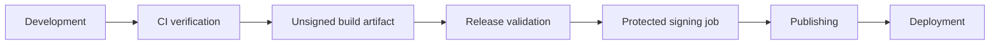

<!-- AUTO-GENERATED:backlink START -->
[← Back](tools.md)
<!-- AUTO-GENERATED:backlink END -->
# Release and desktop packaging model

| Field | Value |
| --- | --- |
| Status | Active |
| Owner | Project team |
| Last review | 2026-08-06 |
| Audience | Release operators and desktop developers |
| Related ATP | N/A — template-level release baseline |

## Purpose

This document separates continuous verification, release validation, signing, publishing, and deployment. It defines the unsigned desktop matrix and the external inputs required for a future signed product release.

## Scope

### Included

- version consistency and release identity checks;
- unsigned Windows, macOS, and Linux verification artifacts;
- explicit tag or manual release validation; and
- signing and notarization activation requirements.

### Excluded

- real certificates, Apple credentials, updater keys, artifact publication, application stores, update services, and cloud deployment.

## Responsibility flow



The baseline automates CI verification, unsigned artifacts, and the release gate. Signing, publishing, and deployment remain explicit product integrations. Normal CI never deploys, uses signing secrets, or creates a public release.

## Desktop verification matrix

`.github/workflows/desktop.yml` runs natively on `windows-latest`, `macos-latest`, and `ubuntu-latest`. Each job installs the platform prerequisites, runs locked Cargo checks, invokes the existing `control.py build desktop` path, and uploads short-lived unsigned artifacts.

These files prove technical buildability. They are not signed production releases. Linux currently verifies a Debian package. Tauri creates the technically available default bundle formats on Windows and macOS.

## Release triggers

`.github/workflows/release.yml` runs only through `workflow_dispatch` or a tag matching `v*.*.*`. It runs tests, builds the web candidate, executes `release check`, and then calls the unsigned desktop workflow. It has read-only repository permission and contains no publication job.

A product repository may add protected signing and publication jobs only after the validation job. Recommended activation conditions are:

1. an annotated, reviewed semantic-version tag or an approved manual dispatch;
2. a protected GitHub Environment with required reviewers;
3. successful tests, builds, `version check`, and `release check`;
4. secrets scoped only to the platform signing job; and
5. write permission granted only to the final publication job.

## Version source of truth

`VERSION` is the intended application version. It uses semantic versioning. Enabled component metadata mirrors that value in:

- `frontend/package.json` and `frontend/package-lock.json`;
- `src-tauri/tauri.conf.json`;
- `src-tauri/Cargo.toml` and the root package entry in `Cargo.lock`; and
- FastAPI OpenAPI metadata at runtime.

Change `VERSION`, synchronize metadata, and verify it:

```sh
python tools/control.py version
python tools/control.py version sync
python tools/control.py version check
```

`version sync` changes metadata but never creates a tag or publishes an artifact.

## Project identity and release gate

Initialize a product identity when generating a project:

```sh
python tools/control.py init \
  --profile desktop-cloud \
  --name CustomerApp \
  --identifier com.customer.app
```

The command derives `customer-app` and updates the frontend package, lockfile, backend display/service names, web artifact name, Compose names, Tauri product metadata, SVG icon title, binary name, Cargo package/author, and window title. Use `--slug` only when the derived value is unsuitable.

Run the non-publishing gate before a release:

```sh
python tools/control.py release check
```

The gate fails for inconsistent versions, a version tag that differs from `v<VERSION>`, a dirty Git tree, unreadable metadata, or known template identities such as `com.example.templateproject`. It checks the Tauri CSP and capabilities and warns when signing configuration is absent. A warning preserves unsigned CI verification; it does not certify a production release.

## Signing and notarization preparation

No signing value is committed or consumed by normal CI. A future protected Windows signing job may expect:

- `WINDOWS_CERTIFICATE_BASE64`;
- `WINDOWS_CERTIFICATE_PASSWORD`; and
- a reviewed, non-secret timestamp service URL in product configuration.

A future protected macOS signing and notarization job may expect:

- `APPLE_CERTIFICATE`;
- `APPLE_CERTIFICATE_PASSWORD`;
- `APPLE_SIGNING_IDENTITY`;
- `APPLE_ID`;
- `APPLE_PASSWORD` containing an app-specific password; and
- `APPLE_TEAM_ID`.

Apple API key authentication may replace Apple ID authentication when the product workflow documents `APPLE_API_ISSUER` and a protected API private key. Secrets are decoded only inside the matching OS job, written to a temporary keychain or file, and deleted by unconditional cleanup steps. Fork pull requests and ordinary pushes must never reach those jobs.

## Tauri security and updater

The baseline CSP allows only local application assets, local development/API connections, image data URLs, and no plugins, objects, arbitrary frames, or remote scripts. A desktop-cloud product adds only its exact HTTPS API origin to `connect-src`. It does not add wildcard hosts or `'unsafe-eval'`.

The default capability contains only `core:default`. Add one permission at a time with an architecture review and acceptance coverage.

The auto-updater is intentionally absent and therefore disabled. A future integration requires a real HTTPS update endpoint, an offline-generated updater signing key, a committed public verification key, rollback behavior, and a signed release pipeline. Do not add a placeholder URL or dummy key.

## Release checklist

```sh
python tools/control.py doctor
python tools/control.py version check
python tools/control.py test --suite all
python tools/control.py build web
python tools/control.py build desktop --dry-run
python tools/control.py release check
```

Before signing, also verify the product icon, bundle identifier ownership, privacy declarations, license files, changelog, API origin/CSP match, platform entitlements, certificate validity, and recovery access to signing credentials.

## Verification

Workflow structure is covered by `tools/tests/test_ci_workflows.py`. Identity, version, CSP, placeholder, and release gate behavior are covered by `tools/tests/test_container_release.py` and profile generator tests.

## Related documents

- [Continuous integration](ci.md)
- [Tooling guide](tooling.md)
- [Container builds](container-builds.md)
- [Deployment architecture](../def/deployment-architecture.md)
- [Framework architecture](../def/architecture.md)
