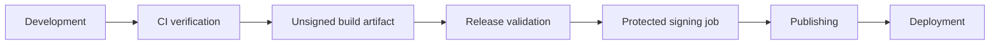

<!-- AUTO-GENERATED:backlink START -->
[← Back](tools.md)
<!-- AUTO-GENERATED:backlink END -->
# Release and desktop packaging model

| Field | Value |
| --- | --- |
| Status | Active |
| Owner | Project team |
| Last review | 2026-08-24 |
| Audience | Release operators and desktop developers |
| Related ATP | [ATP-0001](../atp/active/ATP-0001-template-lifecycle.md) |
| Current template version | `1.0.0` |
| Current publication state | No tag and no GitHub Release |

## Purpose

This document separates continuous verification, release validation, signing, publishing, and deployment. It defines the unsigned desktop matrix and the external inputs required for a future signed product release.

## Scope

### Included

- version consistency and release identity checks;
- unsigned Windows, macOS, and Linux verification artifacts;
- explicit tag or manual release validation; and
- signing and notarization activation requirements.

### Excluded

- real certificates, Apple credentials, updater keys, artifact publication, application stores, update services, and cloud deployment.

## Responsibility flow



The baseline automates CI verification, unsigned artifacts, and the release gate. Signing, publishing, and deployment remain explicit product integrations. Normal CI never deploys, uses signing secrets, or creates a public release.

For the template's `1.0.0` candidate, `461fc7519e0db638330904a7496c488e8a0d18bc` is the historical architecture baseline and comparison commit, not the validated migration baseline or an automatic tag target. Any release-preparation change creates a later candidate. No release tag currently exists. The annotated tag `v1.0.0` may be created only for the final candidate on which every required local and remote check succeeded.

## Desktop verification matrix

`.github/workflows/desktop.yml` runs natively on `windows-latest`, `macos-latest`, and `ubuntu-latest`. Each job installs the platform prerequisites, runs locked Cargo checks, invokes the existing `control.py build desktop` path, and uploads short-lived unsigned artifacts. Pushes, pull requests, and workflow invocations without an explicit Linux bundle input build only `deb`; a manual or reusable invocation may provide a validated explicit list. Release Validation always supplies `deb,rpm,appimage` and must not fall back to the normal DEB-only default.

| Linux format | Intended verification purpose |
| --- | --- |
| DEB | Candidate for Debian- and Ubuntu-based systems |
| RPM | Candidate for RPM-based distributions |
| AppImage | Portable candidate intended to reduce distribution-specific installation requirements |

A real Linux build removes only the generated Linux bundle output directories before invoking Tauri. It then requires at least one fresh, regular, nonempty file for every requested format. The deterministic `.dist/desktop/linux/linux-bundles.json` manifest records repository-relative paths, sizes, and SHA-256 digests; `.dist/desktop/linux/SHA256SUMS` records the same package checksums. Release Validation uploads these evidence files together with the `.deb`, `.rpm`, and `.AppImage` files in the aggregate `desktop-linux-unsigned` artifact.

All Linux outputs are unsigned x86_64 verification candidates built against the current Ubuntu runner and its glibc baseline. They are not published production packages, and a successful build does not guarantee runtime compatibility with every Linux distribution. ARM64, ARMv7, Flatpak, and Snap are outside this matrix; Flatpak and Snap require separate future distribution integrations. Tauri continues to create the technically available default bundle formats on Windows and macOS.

## Release triggers

`.github/workflows/release.yml` runs only through `workflow_dispatch` or a tag matching `v*.*.*`. It runs the quality gate, the read-only semantic documentation check and its focused tests, the complete project tests, web and container builds, and `release check`; it then calls the unsigned desktop workflow with the explicit Linux bundle contract `deb,rpm,appimage`. It has read-only repository permission and contains no publication job.

A product repository may add protected signing and publication jobs only after the validation job. Recommended activation conditions are:

1. an annotated, reviewed semantic-version tag or an approved manual dispatch;
2. a protected GitHub Environment with required reviewers;
3. successful tests, builds, `version check`, and `release check`;
4. secrets scoped only to the platform signing job; and
5. write permission granted only to the final publication job.

## Version sources of truth

In the template source repository, root `VERSION` classifies the template release. During generation it is recorded as the installed template version. In a generated repository, root `VERSION` becomes the product version and the product owns its future release sequence. The installed template SemVer and exact template commit remain separately recorded in `.template/state.toml`.

The exact template commit is authoritative lifecycle provenance. SemVer is a human-readable release classification: equal template versions at different commits do not make the revisions identical.

The current repository's root `VERSION` uses semantic versioning. Enabled product component metadata mirrors that value in:

- `frontend/package.json` and `frontend/package-lock.json`;
- `src-tauri/tauri.conf.json`;
- `src-tauri/Cargo.toml` and the root package entry in `Cargo.lock`; and
- FastAPI OpenAPI metadata at runtime.

Change a product `VERSION`, synchronize its metadata, and verify it:

```sh
python tools/control.py version
python tools/control.py version sync
python tools/control.py version check
```

`version sync` changes product metadata but never changes installed template provenance, creates a tag, or publishes an artifact. `template update` never calls `version sync` and never replaces the product version with the template version.

For a release version, verify the enabled canonical values in `VERSION`, the frontend package and root lockfile package, the Tauri configuration, and the Rust package and its root `Cargo.lock` entry. Dependency, schema, API, and document-format versions are not application-version mirrors and must not be changed by a broad text replacement.

## Managed product lifecycle preflight

A managed product release checks lifecycle integrity independently from release version consistency:

```sh
python tools/control.py template status
python tools/control.py template verify
python tools/control.py version check
```

Status and verification require no network. A template update is a separate maintenance operation against an explicitly trusted local checkout; it does not belong implicitly in a product release. After applying an update, review the lifecycle report and product diff, run the complete product gate, and commit the accepted product and `.template/` changes through the normal product workflow. `release check` still requires the resulting worktree to be clean.

An invalid manifest, unknown template ID, dirty-source baseline, identity mismatch, unexpected profile/capability change, unknown migration ID, or inconsistent product version blocks lifecycle acceptance. No release result should conceal such a failure.

## Project identity and release gate

Initialize a product identity when generating a project:

```sh
python tools/control.py init \
  --profile desktop-cloud \
  --name CustomerApp \
  --identifier com.customer.app
```

The command derives `customer-app` and updates the frontend package, lockfile, backend display/service names, web artifact name, Compose names, Tauri product metadata, SVG icon title, binary name, Cargo package/author, and window title. Use `--slug` only when the derived value is unsuitable.

Run the non-publishing gate before a release:

```sh
python tools/control.py release check
```

In the template source repository, the gate recognizes the profile-matrix workflow as the master marker and accepts the intentional canonical scaffold identity. Generated projects do not contain that workflow marker: their gate fails for known template identities such as `com.example.templateproject` until product identity is configured. In both repository types, the gate fails for inconsistent versions, a version tag that differs from `v<VERSION>`, a dirty Git tree, or unreadable metadata. It checks the Tauri CSP and capabilities and warns when signing configuration is absent. A warning preserves unsigned CI verification; it does not certify a production release.

The gate is necessary but not sufficient. A successful manual `release check` outside tag context reports that tag validation is not applicable; it does not prove that a tag exists, is annotated, targets the candidate, was pushed, or has successful tag-triggered workflows.

## Candidate and same-SHA verification

Create the candidate only after the complete local gate is green. Record its full SHA outside the versioned commit content, then push it without rewriting history. The required GitHub evidence consists of all six successful Core CI jobs, including `Core / Documentation Check`, plus successful Profile Matrix, PostgreSQL Integration, Desktop CI, and Release Validation runs whose `headSha` is exactly that candidate.

```sh
FINAL_CANDIDATE_SHA=$(git rev-parse HEAD)
git status --short

gh run list \
  --commit "$FINAL_CANDIDATE_SHA" \
  --limit 100 \
  --json databaseId,workflowName,status,conclusion,headSha,event,url \
  -R kleiveist/Template-Projekte
```

Use `workflow_dispatch` on the candidate ref when a required workflow was not triggered automatically, and watch each resulting run with `gh run watch <RUN_ID> --exit-status`. A fix creates a new candidate SHA and invalidates the earlier candidate as the common release proof; rerun every required gate affected by the new commit.

Do not write `FINAL_CANDIDATE_SHA` into a file that is part of that same candidate commit. Record the exact final SHA in GitHub Actions evidence and the final operator report. A future annotated tag, optional GitHub Release, and external release manifest must refer to the same SHA.

## Workflow-run classification and retention

Before deleting any historical Actions run, classify it and retain the evidence needed to explain the decision:

| Category | Classification | Release action |
| --- | --- | --- |
| A | Current reproducible project defect | Fix first; retain the failed run and link its successful replacement |
| B | Current credible temporary infrastructure failure | Rerun failed jobs once; investigate repeated failure |
| C | Superseded-commit failure with a newer successful replacement | Delete only after final same-SHA CI is green and the decision is recorded |
| D | Obsolete/replaced workflow run | Confirm the replacement, then handle like category C |
| E | Release, tag, artifact, or acceptance evidence | Retain |

Cleanup is always by one explicit run ID. Never delete runs for the final release SHA, tag runs, successful release evidence, unexplained current failures, or runs with needed artifacts. Record the run ID, workflow, commit, date, conclusion, cause, replacement run, and deletion reason. Do not rewrite Git history, delete commits or branches, or move tags to hide a status.

## Annotated tag procedure

Tag only after the working tree is clean, all versions equal the intended release version, and all required local and same-SHA remote evidence is green:

```sh
FINAL_RELEASE_SHA=$(git rev-parse HEAD)
git status --short
git tag --list v1.0.0

git tag -a v1.0.0 \
  "$FINAL_RELEASE_SHA" \
  -m "Template-Projekte v1.0.0"

git rev-parse v1.0.0^{commit}
git rev-parse HEAD
git push origin v1.0.0
```

The two resolved commit SHAs must match. Never use `--force`, replace an existing tag, or silently move it after a tag-workflow failure. If `v1.0.0` already exists, stop and compare its local target, remote target, and any associated release before taking further action. After pushing, verify both the annotated tag object and its peeled commit with `git ls-remote --tags origin v1.0.0 'v1.0.0^{}'`, then verify all tag-triggered runs. A failed tag workflow leaves the release incomplete; it does not authorize moving the tag.

The baseline workflow deliberately contains no GitHub Release publication job. If maintainers explicitly choose to publish a GitHub Release, create it only after the annotated tag is pushed and verified, use reviewed English release notes, and keep the final SHA and known limitations explicit. That publication decision does not imply production readiness for every generated product.

## Signing and notarization preparation

No signing value is committed or consumed by normal CI. A future protected Windows signing job may expect:

- `WINDOWS_CERTIFICATE_BASE64`;
- `WINDOWS_CERTIFICATE_PASSWORD`; and
- a reviewed, non-secret timestamp service URL in product configuration.

A future protected macOS signing and notarization job may expect:

- `APPLE_CERTIFICATE`;
- `APPLE_CERTIFICATE_PASSWORD`;
- `APPLE_SIGNING_IDENTITY`;
- `APPLE_ID`;
- `APPLE_PASSWORD` containing an app-specific password; and
- `APPLE_TEAM_ID`.

Apple API key authentication may replace Apple ID authentication when the product workflow documents `APPLE_API_ISSUER` and a protected API private key. Secrets are decoded only inside the matching OS job, written to a temporary keychain or file, and deleted by unconditional cleanup steps. Fork pull requests and ordinary pushes must never reach those jobs.

## Tauri security and updater

The baseline CSP allows only local application assets, local development/API connections, image data URLs, and no plugins, objects, arbitrary frames, or remote scripts. A desktop-cloud product adds only its exact HTTPS API origin to `connect-src`. It does not add wildcard hosts or `'unsafe-eval'`.

The default capability contains only `core:default`. Add one permission at a time with an architecture review and acceptance coverage.

The auto-updater is intentionally absent and therefore disabled. A future integration requires a real HTTPS update endpoint, an offline-generated updater signing key, a committed public verification key, rollback behavior, and a signed release pipeline. Do not add a placeholder URL or dummy key.

## Release checklist

```sh
python tools/control.py doctor
python tools/control.py config doctor
python tools/control.py quality
python tools/control.py version check
python tools/control.py test --suite all --report
python tools/control.py build web
python tools/control.py docs index
python tools/control.py docs check
python tools/control.py tauri doctor
python tools/control.py build desktop --dry-run --no-clean
python tools/control.py release check
```

`docs index` is the intentional PyGitIndex regeneration step; `docs check` is the reproducible read-only release gate. Inspect the navigation diff between them. If regeneration changes tracked files, review and commit those changes, then restart the clean-candidate checks. `docs index --dry-run` is an optional preview and is not a substitute for either step.

Also complete the five-profile matrix, the three valid PostgreSQL combinations with real database connections, the two invalid-combination checks, and the native Linux/macOS/Windows workflow matrix. Investigate every warning. A skipped or unexecuted path must remain recorded as such and cannot be promoted to `PASS`.

For every generated profile, the matrix also runs `template status` and `template verify` immediately after generation. A clean CI source must produce `provenance = "generated"`, `source_dirty = false`, and a valid baseline manifest.

Before signing, also verify the product icon, bundle identifier ownership, privacy declarations, license files, changelog, API origin/CSP match, platform entitlements, certificate validity, and recovery access to signing credentials.

## Verification

Workflow structure is covered by `tools/tests/test_ci_workflows.py`. Identity, version, CSP, placeholder, and release gate behavior are covered by `tools/tests/test_container_release.py` and profile generator tests.

## Related documents

- [Continuous integration](ci.md)
- [Tooling guide](tooling.md)
- [Container builds](container-builds.md)
- [Deployment architecture](../def/deployment-architecture.md)
- [Framework architecture](../def/architecture.md)
- [Template lifecycle](../def/template-lifecycle.md)
- [Template migrations](template-migrations.md)
